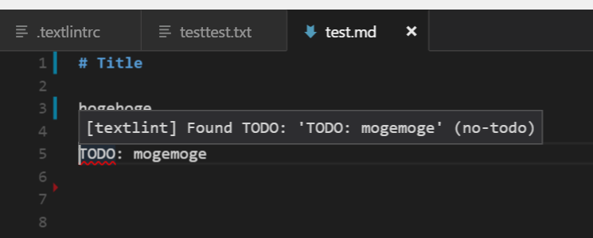

# VS Code textlint extension

Integrates [textlint](https://textlint.github.io/) into VS Code. If you are new to textlint check the [documentation](https://textlint.github.io/).

The extension uses the textlint library installed in the opened workspace folder. If the folder doesn't provide one the
extension looks for a global install version. If you haven't installed textlint either locally or globally do so by running
`npm install textlint` in the workspace folder for a local install or `npm install -g textlint` for a global install.

On new folders you might also need to create a `.textlintrc` configuration file. You can do this by either running
[`textlint --init`](https://github.com/textlint/textlint/blob/master/docs/getting-started.md#configuration) in a terminal or by using the VS Code
command `Create '.textlintrc.json' file`.

## Settings Options

* `textlint.run`
  * run the linter `onSave` or `onType`, default is `onType`.
* `textlint.nodePath`
  * use this setting if an installed textlint package can't be detected, for example `/myGlobalNodePackages/node_modules`.

## Release Notes

### 0.0.1
* Initial Release

## Screenshots

